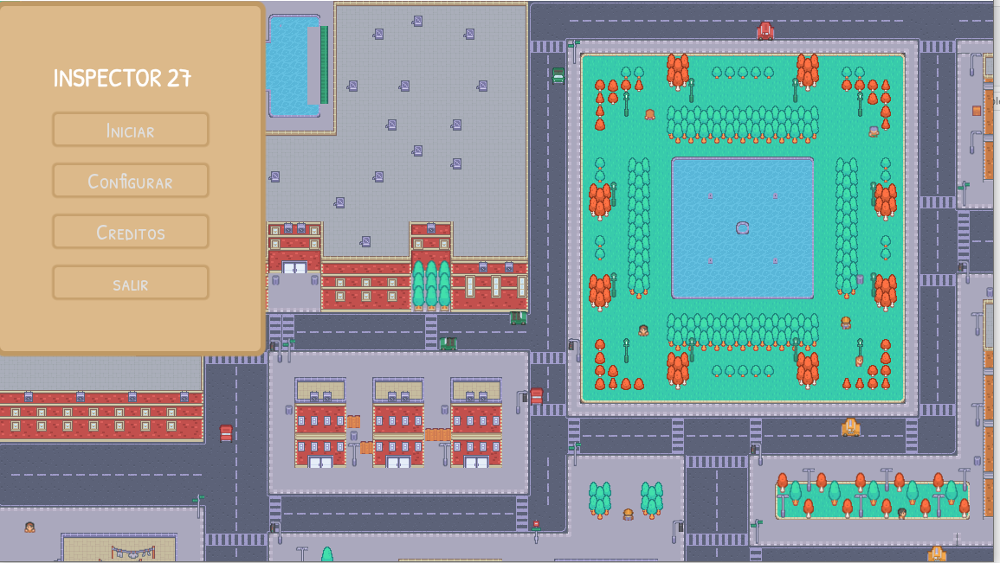

# El inspector 27

El inspector 27 es un juego tipo ctf, donde tu como jugador tienes 3 fases para resolver el juego, se considera terminado cuando encuentras las 3 partes de la bandera.
## Indice
- [Acerca del proyecto](#-Acerca-del-proyecto)
- [Estructura del proyecto](#-Estructura-del-proyecto)
- [Author](#-Author)
## Acerca del proyecto
El inspector 27 es un juego echo en godot, la finalidad de este es que un jugador pueda utilizar sus conocimientos de reversing para leer el proyecto y poder encontrar 3 pedados de bandera en el binario, este juego esta creado con recursos gratuitos de kenney y itchio. 
#
## Estructura del proyecto
```
superagente27
    ├───.godot
    │   ├───editor
	├───addons
    │   └───dialogue_manager # plugin para la parte de dialogos
    ├───assets
	├───character
    │   ├───city
    │   ├───fonts
	│   ├───map
    │   ├───music
    │   └───UI
    ├───Dialogos
	├───Scenes
    ├───Script
    └───Themes
```
## Author

**Samuel navia** (Hacker etico)

[](https://github.com/samres27)[](https://www.linkedin.com/in/samuel-douglas-navia-pe%C3%B1a-8003381b6/)[](https://www.youtube.com/@Samres27) [](https://medium.com/@samres27)